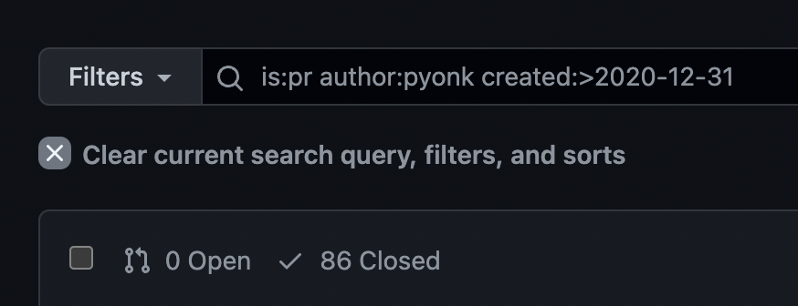
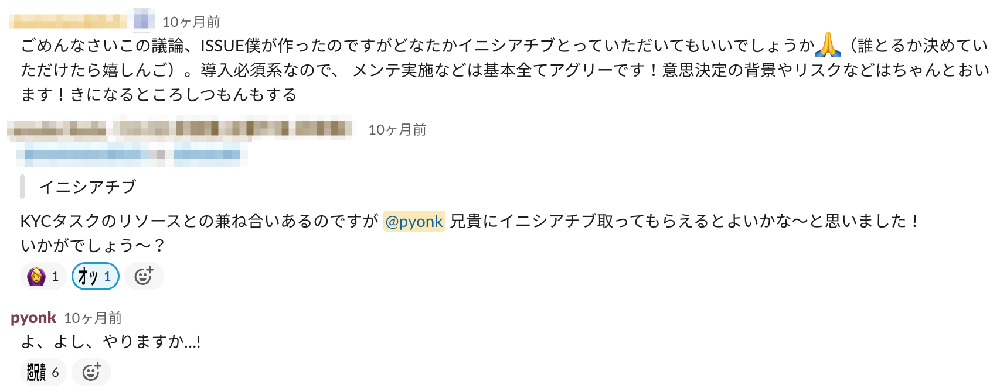

これは[CAMPFIRE Advent Calendar 2021](https://qiita.com/advent-calendar/2021/campfire)の4日目の記事です。  
去年も参加してて[CAMPFIRE.vimをつくった話]()を書いてました。

息子は相変わらず可愛いです。

---

今年もなにか作ったことを記事にしようかなーと思ってました。

このブログはhugoでつくってるので、普段使ってるNeovimの[telescope.nvim](https://github.com/nvim-telescope/telescope.nvim)の[hugoプラグイン](https://github.com/pyonk/telescope-hugo.nvim)を作った話でも書こうかと思って書き始めてたんですが、最近m1のmacを買って昔のmacを初期化しちゃったんで、世の中に出す前に消え去りました。  
こういうのは早めにやっておかないとだめですね。南無🙏

余談はこれくらいにしておいて、せっかくCAMPFIREのアドベントカレンダーなのでなにかCAMPFIREに関係することを書いたほうがよいのでは...と思い直したので
今年はこの1年のCAMPFIREで自分が関わった開発を振り返ることにします。

#### stats的なところ
今年は1月から12月現在で86個のPRを作成してました。  
ちなみに去年1年間は43個だったのでちょうど倍ですね、頑張りました。（と言ってもCAMPFIREの開発に携わったのは6月からだったので実質半年だからペースは変わらないくらいかな）

{{}}

この数が多いのか少ないのかわからないんですが、今年は平日が246日あったらしいので大体3日に1個くらいのペースです。

さて、この86個のPRの中で紹介できそうなのを書いてみようと思います。

#### 年末年始の大掃除系

利用されていないコード、テーブル、gemの削除を行いました。  
本来であれば使わなくなったタイミングで削除できるのが一番なんですが、やっぱり忘れちゃったりすることもあると思います。  
それをそのままにせずに1年の終わりに掃除することで気分良く1年を終えることができますね。  

終わりよければすべてヨシ。

#### 自動テストのランダム落ち

CAMPFIREではCIが導入されていて、pushするごとに走る自動テストでランダム落ちがまま発生していました。  
とくにE2Eテストは結構落ちてた印象で、この改修後ちょっと落ち着いたけど、結局再発しちゃいました。  
ただ、先月くらいにCapybaraのドライバを変えたりなど、画期的に改善されてそれ以降は落ち着いてます。  
日々の開発の中で頻繁に発生するランダム落ちは非常にストレスですね。  
なかなか普段まとまって改善の時間が取れないんですが、長期的に見れば完全にプラスなので絶対やり続けたほうがいいやつ。

#### KYC関連

今年の2月くらいからCAMPFIREでプロジェクトを申請する際にプロジェクトオーナーの方のKYCが必須になっているのですが、それ関連の実装を担当しました。  
着手し始めたのは2020年の10月ころだったので年を跨いでの実装になっています。  
プロジェクトオーナーの方々には負担がかかってしまうのですが、CAMPFIREが目指す安心安全なプラットフォームを目指すためには必要不可欠で重要な部分だと思うのでこれに携われたのはいい経験でした。  

CAMPFIREの開発に携わり始めてから決済以外の部分でいうとかなり大きめなインパクトがある開発で、色々痺れることはありながらも実運用に乗っかってからは安定稼働してくれています。  

#### プロジェクトの新審査ツール開発

CAMPFIREのプロジェクトは誰でも作成、申請ができるようになっていて、日々たくさんの素敵なプロジェクトが申請されています。  
それを1つ1つ丁寧に審査チームの方々が審査してプロジェクトの公開を目指すわけですが、この日々行われる審査に関しての機能はアプリケーション側に組み込まれていませんでした。  
せっかくの審査に関するデータを、より社内で活用できるようにするため新審査ツールの開発がスタートしました。  
審査データを蓄積するだけでなく、審査チームの方々ができるだけ日々の業務をやりやすくするために担当のデザイナーさんとはかなり密に連携をとりながら進めました。  
蓄積された審査データはデータチームによって素敵に処理されて、すごいダッシュボードができててテンションが上がってます。

#### 決済方法選択のABテスト

ABテストは日々いろいろな個所で行われていて、こんな細かいところでは差がでないだろう...と思いながらも実装したテストでも明確に差が出ることがあって、ABテストほんと大事...!!と言う気持ちになっています。  
僕が担当した決済方法選択のABテストは主にUI面での変更のテストです。  
決済はサービスの根幹をなす部分で、そこに関する変更は非常に慎重になるべきところです。  
実装も不具合を起こしたら大変無影響が出てしまうため慎重にやっていく必要があります。

が、その中でもなるべくすっきりと、わかりやすいコードになるように工夫して、より柔軟な対応ができるように実装できたかなと満足しています。  
とはいえ4パターンのテストを4クラスタに分けてテストを行ったためなかなか骨太な実装になりました。

#### 特商法関連

プロジェクトページで 特定商取引法に基づく表記 を表示してるのですが、それに関しての開発です。  
こちらもKYC同様、安心安全のプラットフォームを目指すための施策ですね。  
プロジェクトの申請に関わる画面ということでやはり慎重になるべきところの1つなので、複数回ABテストを分けて実施したのが印象的です。  

#### auPAYミニアプリ関連

年内で最後の大きめの開発でした（多分）。  
プレスリリースもでてます🎉  
[https://prtimes.jp/main/html/rd/p/000000387.000019299.html](https://prtimes.jp/main/html/rd/p/000000387.000019299.html)

auPAY支払い自体はすでに導入されていたのでミニアプリ連携が主な開発部分でした。  
au ID認証部分で[OpenIDを利用している](https://id.auone.jp/id/pc/help/idlogin/2.html)こともあり、そちらに関しての調査を合わせて行ったことで少し詳しくなったかなと思います。  

また仕様書をもとに手元で動く認証用のモックサーバーを作成したのですが、いつか業務で扱いたいなと思っていたGoで書いてみたりして個人的には挑戦しがいのある開発でした。

#### 実装以外

一応リードエンジニアという肩書きがあるので、チームメンバーのサポートやオンボーディングの整備、中学生以来にイニシアチブを発揮したりなど、正直自分につとまるのかなあというのもなんとかひいこらいいながらやってました。

ちなみに中学生の時のイニシアチブは体育祭で応援団長をしてて、それです。
{{}}

そういえば春先には人生で初めての登壇を経験しました。  
リードエンジニアになってやってること、気をつけてることなどを発表しました。  
意外と反響もあって発表してよかったですね。


立場は人を育てるっていうのを実感した1年でした。

### CAMPFIRE以外

書き始めた時はCAMPFIRE以外のことも書こうかな思ってたんですが、思いのほか長くなってしまったので少しだけ。  

個人的には色々新しい言語を触ってみたいなあと言う気持ちが強くて今年はGoとRustを触ってみたりしました。

Goをやるなら[gophercises](https://gophercises.com/)はおすすめです。  
いろんな課題があって、コード書かずとも動画みたり、コード読んだりするだけでも面白かったです。

Rustはとりあえずmicrosoftが提供している[これ](https://docs.microsoft.com/ja-jp/learn/paths/rust-first-steps/)をざっとさらったのと、CLIでいい感じに使えるタスク管理ツールが欲しかったので[作ってる途中](https://github.com/pyonk/dan-task-ddd)と言う感じです。

### 最後に

そういえば最近[CAMPFIREのCM(成功者の声編)](https://www.youtube.com/playlist?list=PL-8i2hYkhBmE--6LslAVScN7a89aFnEH5)が放映されていて、まとまった動画をみたのですが「夢が叶った」とか「実現できて本当によかった、ありがとう！」ということをおっしゃっていただいていました。

これをみた後、自分達でこのサービスを作ってきているんだという自尊心が高まったり、やりがいを実感しました。

このCMもCAMPFIREをより多くの人に知ってもらって使ってもらうという側面がありつつも、中の人たちにとってもうれしい内容になってて最高だな〜〜と思ったのと同時に、まだまだ課題や伸び代があるサービスでもあるので、改めてCAMPFIREをより良いものにしていきたいと言う気持ちが強まりました。

ということでやりがいを超感じられる職場はいかがでしょうか？？？  
CAMPFIRE本体やエンジニア以外でも積極採用中なのでよろしくお願いしますー！

https://www.wantedly.com/companies/campfirejp/projects

---

ということでこの辺で終わりにしようと思います。

今年も1年間お疲れ様でした。

明日はQAエンジニアの駒井さんです！🙌
