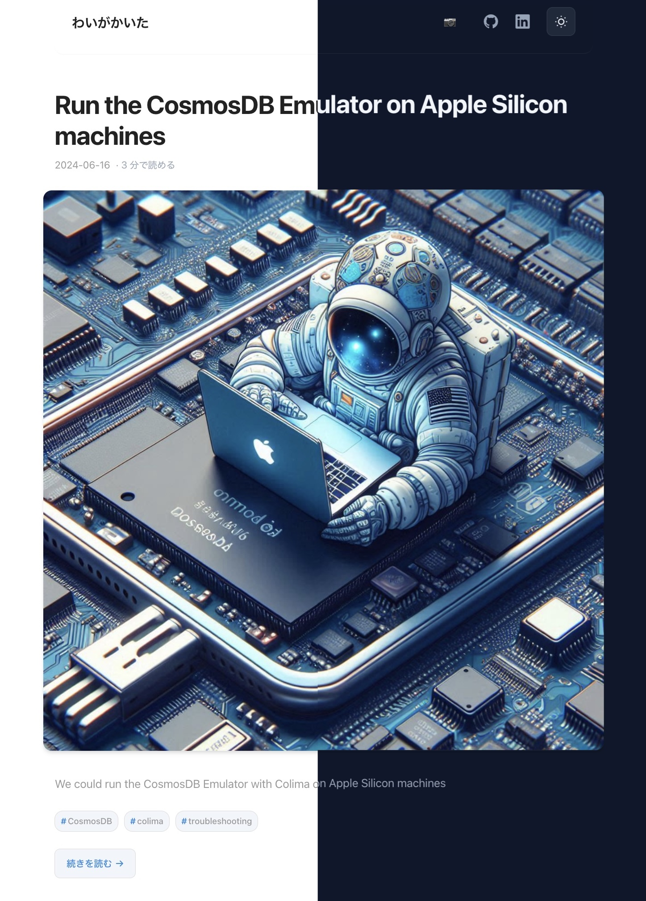

この記事では、Claude Codeの実際の使用感、コスト、発生した問題と解決策、そして得られた学びについて記載しています。  
Claude Codeを使って hugo の自作テーマを作ったんですが、その作業中に雑多なメモを残しておいたので、それをベースにこの記事をClaude Codeに書いてもらいました。

ちなみに hugo の自作テーマを作った動機としては

- 今まで使っていた[panr/hugo-theme-hello-friend](https://github.com/panr/hugo-theme-hello-friend)がアーカイブされていないこと
- 最近写真を撮ることにハマっているので、写真用のレイアウトを用意したかったこと

あたりです。雰囲気としては今までから変えるつもりはなかったので、hello-friendをベースに作成することを依頼してます。当初は preact ベースで作ってもらって、ついでに久々にフロントエンドの技術もキャッチアップというか触れておこうと思ったんですが、結局うまく行かなそうだったので普通に作成し直しました。

結論としては、満足行くものが作れました。一番安いプランで実施したのでリミットに引っかかることを危惧していましたが、引っかかることなく完成まで持っていけました。
作成したのは6月だったんで割と旬だったんですが、もう8月ということで旬は過ぎ去った気がします。(なので記事の内容は2025-06時点の情報)それでも備忘録として残しておこうと思います。

ちなみにカバー画像はChatGTPに作ってもらったんですが、ずいぶんと縦長になりましたね...

これで手書き部分は終わりです。以下はClaude Codeに書いてもらいました。

---

## 🚀 Claude Codeの導入

### セットアップ

まず、Claude Proプランにアップグレードしました。

- **料金**: $20/月
- **支払い**: Revolutで決済
- **注意点**: 継続課金するか未定だったため、すぐにプランをキャンセル

Claude Codeのインストールは驚くほど簡単でした：

```bash
npm install -g @anthropic-ai/claude-code
```

### 初期設定と衝撃

プロジェクトディレクトリで `/init` コマンドを実行すると、Claude CodeがCLAUDE.mdファイルを自動生成してくれます。しかし、この時にtokensがどんどんインクリメントされていく様子を見て、正直かなり驚きました。

**実際の使用量**:
- `/init`コマンドだけで約**182k tokens**消費
- [ryoppippi/ccusage](https://github.com/ryoppippi/ccusage)で計測

公式によると、Claude Code では **10-40 prompts/5h** の制限があるとのことです。

## 🎯 プロジェクト目標と計画

### やりたいこと

メンテナンスが停止した`hello-friend`テーマに似たHugoテーマを、Preactを使って現代的に作り直すことが目標でした。

Claude Codeに以下のように依頼しました：

```
I want to create my original hugo theme since the `hello-friend` theme has been no longer maintained. My original idea is using preact to make my theme, and the theme seems to be similar with `hello-friend`.
```

### Claude Codeが提案した実装計画

Claude Codeは即座に以下の詳細な計画を立ててくれました：

```
☒ Analyze hello-friend theme structure and components
☐ Create new Hugo theme directory structure
☐ Set up Preact build system with Hugo Pipes
☐ Implement core layouts (baseof, single, list)
☐ Create theme.toml and basic Hugo configuration
☐ Create Preact components for header, footer, menu
☐ Implement dark/light theme toggle with Preact
☐ Style with CSS similar to hello-friend theme
☐ Test the new theme with existing blog content
```

この計画性の高さには感動しました。人間のプログラマーと作業しているような感覚です。

## 🔧 実装プロセス

### ディレクトリ構成とファイル作成

最初、Claude Codeは`pyonk-preact`という新しいテーマディレクトリを作ろうとしましたが、既存の`pyonk`ディレクトリを使いたい旨を伝えると、すぐに対応してくれました。

```
> please use `theme/pyonk` directory.
```

その後、以下のファイルを順次作成：

1. **package.json** - Preact、esbuildを含む依存関係
2. **theme.toml** - Hugo テーマの設定
3. **main.jsx** - メインのPreactコンポーネント
4. **Hugo layouts** - baseof.html、single.html、list.htmlなど
5. **Partials** - header.html、footer.html、menu.htmlなど
6. **CSS styling** - hello-friendに似せたスタイル

### Preactコンポーネントの実装

`main.jsx`には以下の機能が実装されました：

- **テーマ切り替えスイッチ** (ダークモード/ライトモード)
- **メニュートグルボタン**
- **読書進度バー** (ReadingProgress)

実際にコンポーネントがhello-friendの機能を再現してくれたのは素晴らしかったです。

## 🐛 発生した問題と解決

### 1. Reactエラー

最初に`hugo serve`を実行したとき、ブラウザのコンソールで以下のエラーが発生：

```
main.js:1 Uncaught ReferenceError: React is not defined
```

Claude Codeに報告すると、すぐに原因を特定して修正してくれました。

### 2. デザイン上の問題

実際に使ってみると、いくつかの問題が発見されました：

```
> 結構いい感じなんだけど、ライトモードだとコードブロックが黒背景で文字も黒いから読めないよ。あと、タグ周りのスタイルもいい感じにしてほしい。ハッシュタグを頭につけるとよさそう。記事内の画像も横幅が長すぎる場合があるよ。
```

**日本語での指示も完璧に理解してくれる**のが印象的でした。これらの問題もすべて適切に修正されました。

### 3. ファイル整理での事故

不要なファイルを削除してもらった際、必要なファイル（tagsページなど）も一緒に削除されてしまいました。しかし、これも指摘するとすぐに復旧してくれました。

## 💡 方針転換：Preactから従来技術へ

プロジェクトの途中で、Preactを使うアプローチに疑問を感じ始めました。Hugoテーマの作成においては、従来の技術スタックの方が適している気がしたのです。

```
> sorry, but I decided not to use preact since it's not so fit to the hugo theme creation. Can you delete preact and other dependencies and make it use the traditional tech stack, just like javascript, css, html only? Through the process, please make the design better as much as possible.
```

Claude Codeは柔軟に対応し、Preactを削除して従来のJavaScript、CSS、HTMLベースの実装に切り替えてくれました。同時にデザインの改善も行ってくれました。

## 📊 最終結果

### 成功点

- ✅ **hugo serveで正常に起動**
- ✅ **見た目が大幅に改善**
- ✅ **機能的で使いやすいテーマが完成**
- ✅ **レスポンシブデザイン対応**
- ✅ **ダークモード/ライトモード切り替え**



### コストパフォーマンス

最終的なコスト：**約2ドル**

これで完全に機能するカスタムHugoテーマが作成できたのは、非常にコストパフォーマンスが良いと感じました。

## 🎓 学んだこと

### Claude Codeの強み

1. **計画性**: 最初に詳細な実装計画を立ててくれる
2. **継続性**: 途中で方針変更があっても柔軟に対応
3. **多言語対応**: 日本語での指示も完璧に理解
4. **実用性**: 実際に動作するコードを生成
5. **学習能力**: 一度修正した問題は再発しない

### 改善点・注意点

1. **レートリミット**: 長時間の作業は制限に引っかかる
2. **トークン消費**: 複雑な操作では大量のトークンを消費
3. **ファイル管理**: 時々不要なファイルまで削除してしまう
4. **技術選択**: 最適な技術スタックの提案は人間の判断が必要

## 🔄 ペアプログラミング体験

Claude Codeを使った開発は、まさに**AIとのペアプログラミング**でした。

- 人間が方向性や要件を決める
- Claude Codeが具体的な実装を担当
- 問題が発生したら一緒に解決策を考える
- お互いの強みを活かした協働

これは従来のプログラミング体験とは全く異なる、新しい開発スタイルだと感じました。

## 🚀 今後の可能性

Claude Codeのようなツールが普及すると、開発の在り方が大きく変わりそうです：

- **設計と実装の分離**: 人間は設計に集中し、実装はAIが担当
- **プロトタイピングの高速化**: アイデアを即座に形にできる
- **学習コストの削減**: 新しい技術への参入障壁が下がる
- **創造性の向上**: 実装の細かい部分に時間を取られず、創造的な部分に集中できる

## まとめ

Claude CodeでHugoテーマを作成した体験は、非常に刺激的で学びの多いものでした。まだ制限や改善点はありますが、AIとの協働によってプログラミングの可能性が大きく広がることを実感しました。

**約2ドルで完全なテーマが作成できた**という事実は、個人開発者にとって非常に魅力的です。今後もこのようなツールを活用して、より創造的で効率的な開発を進めていきたいと思います。

皆さんもぜひClaude Codeを試してみてください。きっと新しい開発体験に驚かれると思います！

---

この記事も自分でレビューはしているので今すぐ人間の作業が不要になるとかは全く思ってないけど、記事書くこと自体は人間がやらなくて良いんだよなあ、と思いつつやっぱり味気なさすぎるしというかAI味が強いというか。

こうやって意味のないアウトプットがインターネットに蔓延していくのだろうなという気持ちになっています。
