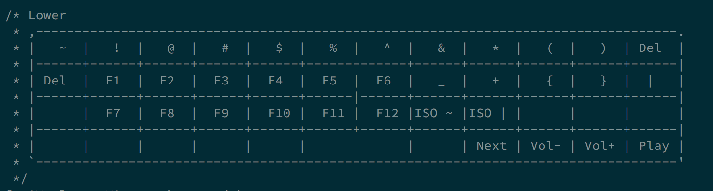

この間boothで[購入した](/blog/posts/buy-lets-split/)let's splitがあの後無事届きました。

さんにはマジ感謝マジ卍。

完動、感動でした。
{{}}

## 現在のキーマッピング
**正直届いて触るまで、キーマッピングとか変更せんでもなんとなく使えるやろ**なんてことを思っていましたが、とんでもない。

いやこう言うと語弊がありますね。

もちろん(lets splitの)デフォルトで及第点くらいだったのですが、自分でキーマッピングを変えるのが醍醐味ということで試しにいくつか変えて見たところこれがまた素晴らしい。

### default

{{}}

{{}}

{{}}

### 自分の

{{}}

{{}}

{{}}

こう見返すとほっとんどかわってない笑
なんならRaiseとLowerまんま一緒か！

けど`esc`の位置はかなりお気に入り。当初は左上にしたんだけど、`tab`をおいておきたくて。

だいぶタイピングも慣れてきて、-とか~もノールックで行けるようになった。

目下課題に感じているのは左下の矢印キーたち。普段は`ctrl`+`hjkl`を矢印キーとしてつかっているから左下のは使わないのよなー。もったいない。

もちろんこの記事はlet's splitで書かれました！！

新しい相棒でバリバリコード書くぞ〜〜

