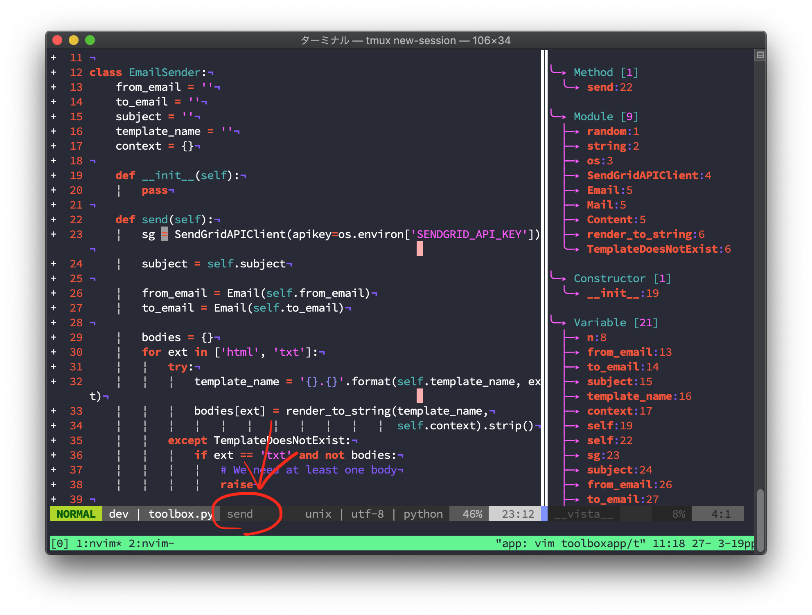

この前[coc.nvim](/blog/posts/how-to-use-coc-vim/)を見つけたけど
またredditにて[vista.vim](https://github.com/liuchengxu/vista.vim)というのを見つけた。

- [vista.vim: A tagbar alternative that supports LSP symbols and async processing : vim](https://www.reddit.com/r/vim/comments/b5pd86/vistavim_a_tagbar_alternative_that_supports_lsp/)

/r/vimのRSS登録しとってよかった。


# vista.vim
vimをIDEのようにしてくれる夢のようなツール。

cocと連携してLSPのシンボルから出してくれるから、別途ctagsとか使わなくていい感じ（ctagsとの連携もできるみたい）。
fzfを使ってシンボルの絞り込み検索もできるので、楽しい感じ。

あたらしいプラグインのようで、まだ発展途上のようだ(2019-03)。

> ⚠️ Currently vista.vim is mostly usable, yet not stable. All the public APIs and global options can be changed or even be removed in the future.  
> ― [liuchengxu/vista.vim: View and search LSP symbols, tags in Vim](https://github.com/liuchengxu/vista.vim)

# とりあえずインストール
例のごとく僕はdeinを使っているので

```toml
[[plugins]]
repo = 'liuchengxu/vista.vim'
depends = ['coc.nvim', 'lightline.vim']
hook_add = '''
  nmap <silent> <C-f><C-v> :<C-u>Vista coc<CR>
  nmap <silent> <C-f><C-s> :<C-u>Vista finder coc<CR>
'''
```

こんな感じで。
使いやすいようにショートカットも登録しておく。

`:Vista finder coc`でcoc.nvimからのシンボルデータをfzfで絞り込みができる。

# ステータスバーにうにゃうにゃ

lightlineのようなしゃれおつステータスバーのための関数も用意されていて、

```toml
[[plugins]]
repo = 'itchyny/lightline.vim'
hook_add = '''
let g:lightline = {
      \ 'colorscheme': 'landscape',
      \ 'active': {
      \   'left': [ [ 'mode', 'paste' ],
      \             [ 'gitbranch', 'readonly', 'filename', 'modified' ],
      \             [ 'vista' ],
      \           ]
      \ },
      \ 'component_function': {
      \   'gitbranch': 'fugitive#head',
      \   'vista': 'NearestMethodOrFunction',
      \ },
      \ }
function! NearestMethodOrFunction() abort
  return get(b:, 'vista_nearest_method_or_function', '')
endfunction
'''
```

こんな感じにしておくとステータスバーにうにゃうにゃ出てくる。


{{}}

cocと連携することでhtml, css, javascriptとかも一気にいい感じにできてとても楽しい。


